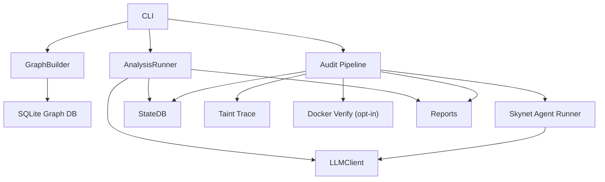

# Skynet Audit

> 基于代码知识图谱的 LLM 安全审计框架（**不是** [云风 Skynet 游戏服务器](https://github.com/cloudwu/skynet)）。

Skynet 是一个基于代码知识图谱的安全审计系统，结合 Tree-sitter/SQLite 图谱、LLM Agent、污点流追踪、组合漏洞分析和可选 Docker PoC 验证，帮助对目标仓库进行结构化安全扫描。

> **项目状态：Alpha** — `scan` / `analyze` / `trace` 为主力路径；`audit run` 八阶段管线已接入 Skynet 自有 Tool Agent（`read_file` / `grep` / `glob` / `read_node`），不依赖 Claude Code SDK。

**License:** [MIT](LICENSE)
## 核心能力

- 代码知识图谱：构建函数、类、调用关系、结构上下文。
- Chunk 安全分析：按优先级分析高风险代码片段。
- Audit 8 阶段管线：Recon → Hunt → Validate → Gapfill → Dedupe → Composite → Trace → Feedback → Report。
- 污点流追踪：source → sink 路径分析与 Flow Memory。
- LLM Provider 抽象：统一走 `LLMClient`，兼容 OpenAI-compatible API。
- 可选 PoC 验证：Docker 沙箱默认关闭，需要显式 `--verify`。

## 架构概览



## 快速开始

```bash
git clone https://github.com/LLAWLIGHT12/skynet.git
cd skynet

python -m venv .venv
# Windows: .venv\Scripts\activate
# Linux/macOS: source .venv/bin/activate

pip install -r requirements.txt
pip install -r requirements-audit.txt
pip install -r requirements-dev.txt
```

复制环境变量模板（**切勿提交 `.env`**）：

```bash
copy .env.example .env   # Windows
# cp .env.example .env   # Linux/macOS
```

在 `.env` 中填入 LLM API Key。若 Key 曾在本地明文保存或对话中暴露，请先在 Provider 控制台**作废并轮换**。
构建图谱：

```bash
python main.py build -d path/to/repo
```

按 chunk 分析：

```bash
python main.py analyze -d path/to/repo --limit 20 --run-id run_demo
```

一键扫描：

```bash
python main.py scan -d path/to/repo --run-id run_demo --max-cost 1.0
```

深度 audit 管线：

```bash
python main.py audit auth-check
python main.py audit run --repo path/to/repo --run-id run_demo
```

Audit 使用 **Skynet LLMClient**（`FALLBACK_LLM_*` 环境变量）+ **多轮 Tool Agent**（读文件、grep、glob、图谱 read_node）。各阶段配置见 `skynet/audit/config/stages.yaml`（`model: default` 表示使用环境变量中的模型名）。

启用 PoC 验证（默认关闭）：

```bash
python main.py audit run --repo path/to/repo --verify
```

## LLM Provider 设计

Skynet 不依赖特定厂商 SDK。Audit、Analyze、Trace 路径都统一通过 `skynet.llm.client.LLMClient` 调用模型。

Audit Agent 通过 JSON action 调用自有工具（`skynet/tools/audit_tools.py`），与污点分析中的 `AgentFlowResolver` 使用同一 LLM 栈。

`LLMClient` 使用 OpenAI-compatible Chat Completions API，因此可以接入：

- DeepSeek
- OpenAI
- 本地或企业网关
- Anthropic 兼容代理
- 任何 OpenAI-compatible Provider

主要环境变量：

| 变量 | 说明 |
| --- | --- |
| `FALLBACK_LLM_API_KEY` | LLM API Key |
| `FALLBACK_LLM_API_BASE_URL` | OpenAI-compatible base URL |
| `FALLBACK_LLM_MODEL_NAME` | 模型名 |
| `FALLBACK_LLM_TEMPERATURE` | 温度 |
| `FALLBACK_LLM_MAX_TOKENS` | 最大输出 token |
| `FALLBACK_LLM_TIMEOUT` | 请求超时 |

## StateDB 路径说明

Skynet 当前使用统一的 `StateDB` 实现：

- `skynet.audit.state.StateDB`：实际实现。
- `skynet.state.StateDB`：对同一实现的复用入口。

CLI 运行时推荐使用 `StateDB.for_repo(repo_root)`，数据库默认位于：

```text
<repo_root>/.skynet/state.db
```

这样每个被扫描仓库拥有独立运行状态、任务、发现、成本与产物索引。

Audit CLI 里的历史 `DB_PATH` 仅作为兼容常量存在；`run/status/report` 命令都应通过 `--repo` 定位目标仓库的 `.skynet/state.db`。

## Windows 兼容性

Windows 可运行核心能力，但部分功能依赖外部工具：

- Docker PoC 验证：需要 Docker Desktop，并且只有显式 `--verify` 才会启用。
- LSP：部分 language server 在 Windows 上安装或启动方式不同，遇到问题可先关闭 LSP 或安装对应语言服务。
- Shell：PowerShell 不支持 `&&` 作为语句分隔符，命令示例可使用分号或单独执行。

## 依赖文件

- `requirements.txt`：核心运行依赖。
- `requirements-audit.txt`：audit CLI 额外依赖（click/rich）。
- `requirements-dev.txt`：测试开发依赖。

## 报告输出

默认报告输出到 `reports/`。StateDB 中同时会记录 JSONL artifact、analysis report、scan report 等产物路径，便于恢复、追踪和审计。

## 开源 / 上传前检查

- [x] `LICENSE`（MIT）
- [x] `.gitignore` 排除 `.env`、`.venv/`、`reports/`、`results/`、`.skynet/`
- [x] `data/knowledge/` 知识库纳入版本控制
- [ ] 在 GitHub 创建仓库（已创建：https://github.com/LLAWLIGHT12/skynet ）
- [ ] 本地 `.env` 填入新 Key 后再跑扫描

贡献指南见 [CONTRIBUTING.md](CONTRIBUTING.md)。