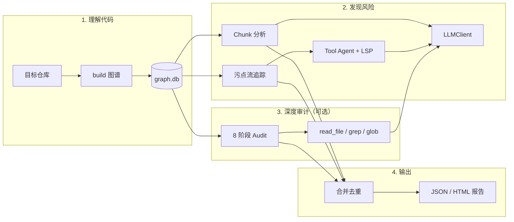
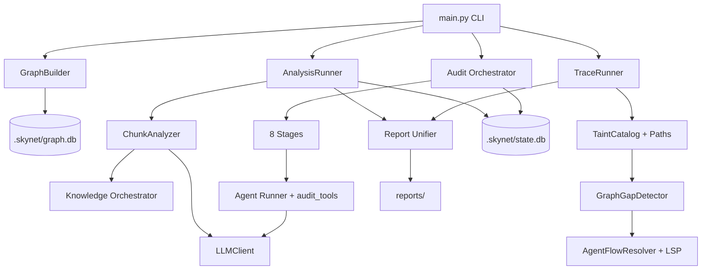

# Skynet Audit

**把代码结构变成安全上下文，再让 LLM 按图索骥地审计。**

[](LICENSE)
[](https://www.python.org/downloads/)
[](#)

> 基于代码知识图谱的 LLM 安全审计框架。  

---

## 为什么做 Skynet

传统安全工具擅长规则，但看不懂业务语义；纯 LLM 审计擅长读代码，却容易「 hallucinate 」、漏掉跨文件链路、成本失控。

Skynet 的思路是：**先建图，再分析，用证据链约束 LLM**。

1. **结构先行** — 用 Tree-sitter 把仓库解析成函数/类级知识图谱，存入 SQLite。LLM 不再面对一整坨仓库，而是面对有邻居、有调用关系、有社区划分的 **Code Chunk**。
2. **优先级驱动** — 与 sink 关联度高的代码优先分析，把 token 花在刀刃上。
3. **污点流串联** — 在图上枚举 source→sink 路径；静态图断边时，用 Gap 评分 + LSP Agent 补边，而不是盲目猜测。
4. **多层知识** — CWE / OWASP / 污点规则 / 框架安全模式 / 项目内误报记忆，一起注入 prompt。
5. **可恢复的运行** — StateDB 记录任务、发现、成本与产物，支持 `--resume` 和预算上限。

Skynet 不是「又一个 ChatGPT 套壳扫漏洞」，而是一套 **图谱 + Agent + 污点 + 报告** 的审计流水线。

---

## 它如何工作



### 两条路径，按需选用

| 路径 | 命令 | 适合场景 |
|------|------|----------|
| **快速扫描** | `scan` | 日常摸底：build → analyze → trace → 合并报告 |
| **分步调试** | `build` / `analyze` / `trace` | 开发插件、调 prompt、控制成本 |
| **深度审计** | `audit run` | 8 阶段 Agent 管线：Recon → Hunt → Validate → … → Report |

---

## 核心能力

### 代码知识图谱

- 基于 [code-review-graph](https://pypi.org/project/code-review-graph/) + Tree-sitter
- 全量/增量构建，后处理含社区发现、flow criticality
- 分析粒度：`Function` / `Class` → 带结构上下文的 Code Chunk

### Chunk 安全分析

- 并发 LLM 分析，按 criticality 排序
- 三层知识注入：外部 CWE/模式、框架规则、项目内历史与误报
- 可选 Bandit 预筛、低置信度 Web 搜索补强

### 污点流追踪

- 从图谱 + `taint_rules.json` 构建 source/sink 目录
- BFS 路径枚举，Gap 检测（动态调用、bare_call、断边等）
- 超阈值路径启动 **mini-Agent**：`read_node` + LSP 补边，结果写入 Flow Memory

### 组合漏洞分析

- 按图谱社区聚类多条流 / chunk 发现
- LLM 二次推理跨模块逻辑链（越权、状态不一致等）

### Audit 八阶段管线

```
Recon → Hunt → Validate → Gapfill → Dedupe → Composite → Trace → Feedback → Report
```

- 自有 **Tool Agent**（`read_file` / `grep` / `glob` / `list_dir` / `read_node`）
- JSON Schema 校验 + repair turn，StateDB 全程可恢复
- 图谱增强：社区、入口点、影响半径注入 Recon/Hunt

### 统一 LLM 层

- 全部走 `skynet.llm.client.LLMClient`（OpenAI-compatible API）
- 熔断、重试、Prompt Cache（可选）
- 兼容 DeepSeek、OpenAI、本地网关等任意兼容端点

---

## 快速开始

### 安装

```bash
git clone https://github.com/LLAWLIGHT12/skynet.git
cd skynet

python -m venv .venv
# Windows
.venv\Scripts\activate
# Linux / macOS
# source .venv/bin/activate

pip install -r requirements.txt
pip install -r requirements-audit.txt
pip install -r requirements-dev.txt
```

### 配置 LLM

```bash
copy .env.example .env          # Windows
# cp .env.example .env          # Linux / macOS
```

编辑 `.env`（**不要提交到 Git**）：

```env
FALLBACK_LLM_API_KEY=your-api-key
FALLBACK_LLM_API_BASE_URL=https://api.deepseek.com/v1
FALLBACK_LLM_MODEL_NAME=deepseek-chat
```

验证配置：

```bash
python main.py audit auth-check
```

### 30 秒体验

```bash
# 1. 构建图谱
python main.py build -d tests/fixtures

# 2. 一键扫描（含污点流 + 报告合并）
python main.py scan -d tests/fixtures --limit-chunks 5 --run-id demo

# 3. 查看报告
python main.py report
```

---

## 命令参考

### 图谱

```bash
python main.py build -d <repo>              # 构建/增量更新图谱
python main.py stats -d <repo>              # 图谱统计
python main.py chunks -d <repo> --limit 20  # 列出可分析 chunk
python main.py preview -d <repo> --index 0  # 预览 chunk + 结构上下文
```

### 分析 & 扫描

```bash
# 按 chunk 分析（可限流、可恢复）
python main.py analyze -d <repo> --limit 20 --run-id my_run

# 一键扫描：build → analyze → trace → merge
python main.py scan -d <repo> --run-id my_run --max-cost 1.0

# 仅污点流追踪
python main.py trace -d <repo> --run-id my_run
```

常用参数：

| 参数 | 说明 |
|------|------|
| `--run-id` | 启用 StateDB，记录进度与成本 |
| `--resume` | 从中断处恢复 |
| `--max-cost` | LLM 成本上限（USD） |
| `--limit-chunks` | 限制分析 chunk 数量 |
| `--no-trace` / `--no-composite` | 跳过污点 / 组合分析 |

### 深度 Audit

```bash
python main.py audit run --repo <repo> --run-id audit_001
python main.py audit status --repo <repo> --run-id audit_001
python main.py audit report --repo <repo> --run-id audit_001 --format md
```

可选能力：

```bash
# 图谱增强（默认开启）
python main.py audit run --repo <repo> --no-graph-enhanced

# Docker PoC 验证（默认关闭，需 Docker）
python main.py audit run --repo <repo> --verify
```

阶段配置：`skynet/audit/config/stages.yaml`（`model: default` 表示使用 `.env` 中的模型名）。

### 报告 & 误报反馈

```bash
python main.py report -i reports/scan_xxx.json
python main.py mark-fp -d <repo> --qualified-name "module::func"
python main.py mark-fp -d <repo> --flow-id <flow_id>
```

---

## 架构



### 知识层

| 层级 | 来源 | 作用 |
|------|------|------|
| 外部 | `data/knowledge/external/` — CWE、OWASP、污点规则、code signals | 模式匹配与检索 |
| 框架 | Django / Flask 等安全知识 | 框架特有 sink/source |
| 内部 | `<repo>/.skynet/knowledge/project.json` | 历史分析、误报标记 |
| Flow Memory | 流分析历史 | 跳过已分析流、积累上下文 |

### 持久化布局

扫描目标仓库 `<repo>` 下会生成：

```text
<repo>/.skynet/
├── graph.db          # 代码知识图谱
├── state.db          # 运行状态（指定 --run-id 时）
└── knowledge/
    └── project.json  # 项目内安全记忆
```

Skynet 自身运行时报告默认写入 `./reports/`。

---

## 配置

主配置文件：`config/skynet.yaml`

| 区块 | 关键项 |
|------|--------|
| `graph` | 图谱目录、可分析节点类型、上下文深度 |
| `analyze` | 并发数、输出目录、置信度阈值 |
| `taint` | 最大跳数、Gap 阈值、Agent 预算 |
| `lsp` | 语言服务器（污点 Agent 补边） |
| `external_scanner` | Bandit 等外部工具 |
| `verify` | Docker PoC（默认关） |

环境变量优先级高于 yaml 中的 LLM 占位项，见 `.env.example`。

---

## 环境变量

| 变量 | 说明 |
|------|------|
| `FALLBACK_LLM_API_KEY` | LLM API Key（必填） |
| `FALLBACK_LLM_API_BASE_URL` | OpenAI-compatible Base URL |
| `FALLBACK_LLM_MODEL_NAME` | 模型名称 |
| `FALLBACK_LLM_TEMPERATURE` | 采样温度 |
| `FALLBACK_LLM_MAX_TOKENS` | 最大输出 token |
| `FALLBACK_LLM_TIMEOUT` | 请求超时（秒） |
| `TAVILY_API_KEY` | 可选，启用 Tavily 搜索时 |

---

## 项目结构

```text
skynet/
├── graph/          # 图谱构建与 chunk 生成
├── analyze/        # Chunk 分析、组合漏洞
├── taint/          # 污点目录、路径、Gap、Agent 补边
├── audit/          # 8 阶段管线、StateDB、Tool Agent
├── llm/            # LLMClient、熔断、重试、缓存
├── knowledge/      # 三层知识检索与持久化
├── merge/          # 多源发现合并、CVSS
├── report/         # HTML / JSON 报告
├── tools/          # LSP、Bandit、audit_tools
└── verify/         # Docker 沙箱 PoC（可选）

data/knowledge/external/   #  bundled 安全知识库
config/skynet.yaml         #  默认配置
tests/                     #  单元与集成测试
```

---

## 开发与测试

```bash
pytest tests/ -q --ignore=tests/benchmark
```

部分集成测试（`test_smoke`、`test_overrides`）依赖完整图谱与 LSP，CI 默认跳过。

贡献指南：[CONTRIBUTING.md](CONTRIBUTING.md)

---

## 平台说明

| 平台 | 支持情况 |
|------|----------|
| Linux / macOS | 完整支持 |
| Windows | 核心功能可用；LSP / Docker PoC 可能需要额外配置 |

PowerShell 不支持 `&&` 链式命令，请分行执行或使用 `;`。

---

## 路线图

- [ ] Audit 阶段 Bash / scratch PoC 沙箱
- [ ] live_target HTTP 探测与 Validate 联动
- [ ] 更多语言图谱覆盖与 LSP 开箱即用
- [ ] 插件化外部扫描器（Semgrep 等）

---

## 免责声明

Skynet Audit 处于 **Alpha** 阶段，用于安全研究与辅助审计，**不能替代** 专业 SAST/DAST 产品或人工渗透测试。LLM 输出务必人工复核。

---

## License

[MIT](LICENSE) © Skynet Contributors
